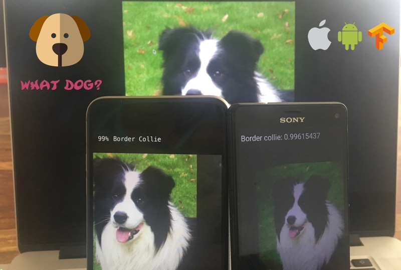

<p align="center">
  
</p>

[](http://twitter.com/madhavajay)


# 🐶 What Dog? - Mobile App for Dog Breed Detection
"What Dog?" is a mobile app based on the TensorFlow example classification app with a new model trained to detect dog breeds.

## That app already exists
Yes, there's already one from the guys at [Microsoft](https://itunes.apple.com/us/app/what-dog-a-microsoft-garage-project/id1050367912?mt=8) and probably numerous others, but the Microsoft one simply submits an image to a web service.

Unlike theirs, I wanted my app to do offline on-device inference with my trained model.

Plus this serves as an open source example for any other Udacity AIND students who want to test their models outside on RL dogs.

## Why Dog Breeds?
I did this project as part of the [Udacity - Artificial Intelligence Nanodegree](https://github.com/madhavajay/nd889) on CNNs and transfer learning in Keras. You can read more about the project in my [dog_app.ipynb](https://github.com/madhavajay/nd889/blob/dog_classifier/2_deep_learning/4_dog_breed_classifier/dog_app.ipynb) Jupyter Notebook.

The model was based on Google's InceptionV3 model and retrained using Transfer Learning. I followed some suggestions for Transfer Learning and Fine Tuning from [@dlsandbox](https://twitter.com/dlsandbox) on his [Github](https://github.com/DeepLearningSandbox/DeepLearningSandbox/blob/master/transfer_learning/fine-tune.py).

After an afternoon of playing around with an AWS p2.xlarge I got the model to an accuracy of 87.2% on the test set.

Once the model was trained and working, I wanted to test it on real dogs outside, so I figured I would need to run it on my phone.

[@timanglade](https://twitter.com/timanglade) Wrote about his experience making the HBO show Silicon Valley's [Not Hotdog App](https://itunes.apple.com/us/app/not-hotdog/id1212457521?mt=8) and [deploying a Keras model to mobile](https://hackernoon.com/how-hbos-silicon-valley-built-not-hotdog-with-mobile-tensorflow-keras-react-native-ef03260747f3). I also found this great guide by [@stratospark](https://twitter.com/stratospark) on doing a similar Keras to TensorFlow [app for Food Detection](http://blog.stratospark.com/creating-a-deep-learning-ios-app-with-keras-and-tensorflow.html).

Inspired by the Not Hotdog App and food-101 guides, I decided to use TensorFlow SDK to make "What Dog?".

Unfortunately there was no simple instructions on how to get my model from Keras into a TensorFlow pb (protobuff) file ready for on-device inference.

After speaking with both @timanglade and @stratospark on Twitter, reading lots of TensorFlow GitHub issues and modifying the useful [keras_to_tensorflow tool](https://github.com/amir-abdi/keras_to_tensorflow), I managed to get it working.

## How - Using your own Dog Breed Classifier Keras Model
This should just work if your model is based off the Google InceptionV3 model, or from my Jupyter Notebook, otherwise you might need to make some adjustments.

1. Place your hdf5 keras model in the data folder
2. Run my modified keras_to_tensorflow.ipynb in the model_converter folder
3. Run test_pb_model.ipynb and verify the model is still working
    - If you only want iOS skip to step 7
4. For Android I needed to run the tensorflow tool transform_graph on the pb file
    - To get the transform_graph tool I had to compile tensorflow using bazel in a Ubuntu VM
5. Read the [transform_graph instructions](https://github.com/tensorflow/tensorflow/tree/master/tensorflow/tools/graph_transforms#using-the-graph-transform-tool) 
6. Pay attention to the inputs and outputs flags listed in the test_pb_model.ipynb, mine were --inputs='input_3' and --outputs='softmax0'
7. Copy your new pb file (the transform_graph model works on iOS and Android) into the data folder and replace the old one, or change the project source code to reference your new pb file.
8. Do the same for the labels text file

# Building the App
## iOS
Inside the ios folder run:
```
$ pod install
```

1. Open whatdog.xcworkspace
2. Change Signing Team if necessary
3. Select the "whatdog - Debug" scheme
4. Build & Run

## Android

1. Import the android folder into Android Studio
2. Build & Run


## Issues
There plenty of bugs, this is barely Beta quality. The model is large and real time inference takes a lot of CPU power. The app struggles to run on my Sony Xperia Z3 Compact. It runs much better with something like an iPhone 6 or Samsung Galaxy 6.

If the app isn't working properly just quit it and open it again. Sometimes the inference gets stuck or confused by certain images.

Pull Requests are welcome. 😊

# Credits

Thanks to everyone who wrote guides, code, or answered my questions on Twitter. Big thanks to Udacity for the AIND and Google for making TensorFlow!

## Icon Credits
The icon graphics used for "What Dog?" are from flaticon.com.

Icons made by <a href="http://www.freepik.com" title="Freepik">Freepik</a> from <a href="http://www.flaticon.com" title="Flaticon">www.flaticon.com</a> is licensed by <a href="http://creativecommons.org/licenses/by/3.0/" title="Creative Commons BY 3.0" target="_blank">CC 3.0 BY</a>